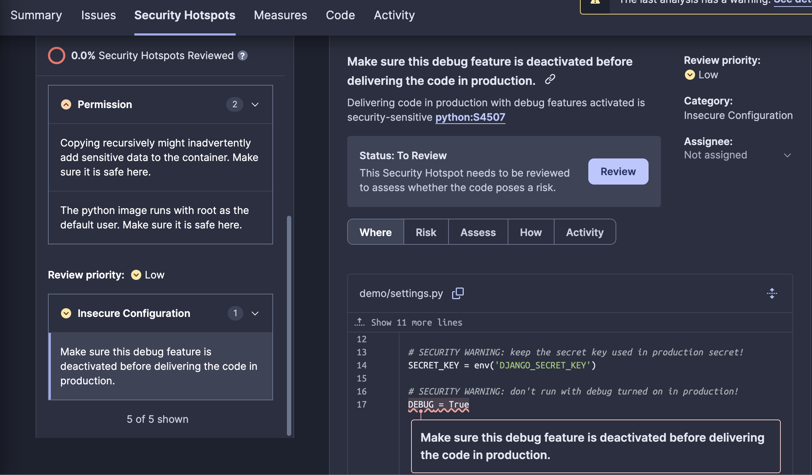
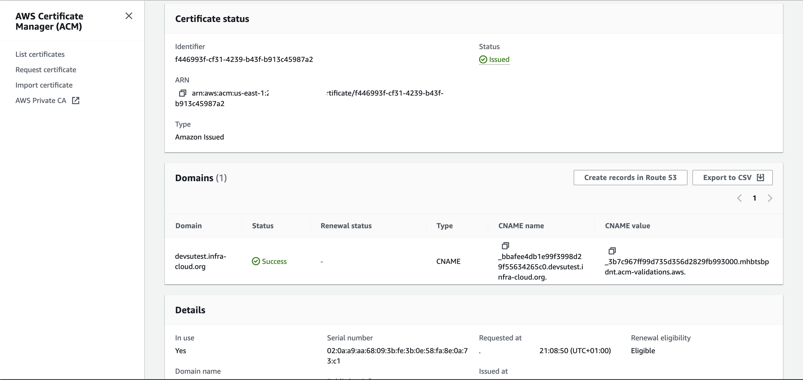

# DevOps Technical Assignment

# Project link

[Project repo](https://github.com/zen-python/demo-devops)

[Project endpoint](https://devsutest.infra-cloud.org/api/users/)

# Assumptions

This proposed solution to the technical assignment illustrates how to build the complete CI/CD flow using GitHub as the repository and CircleCI (Free 6000 build minutes per month.) to process the pipeline. The solution automates the build & push of the container image and Helm chart using CircleCI, pushing them to a private Amazon Elastic Container Registry (Amazon ECR), and then deploying via Helm to the AWS EKS Cluster. This minimizes the possibility of human error asignificantly trims down the deployment time by a less than a minute. The infrastructure in AWS was built using Terraform and is included in the project deliverable zip file.

## Prerequisites and Limitations

### Prerequisites

- An active AWS account.
- An active GitHub account.
- An active CircleCI account.
- An active SonarCloud account.
- An active Docker Hub account.
- The following tools correctly configured on the local machine:
  - **AWS CLI:** Version 2.15.13 with Python 3.11.6
  - **Terraform:** Version 1.7.0
  - **jq:** Version 1.6
  - **kubectl:** Client Version v1.29.1, Server Version v1.28.5-eks-5e0fdde
  - **Helm:** Version 3.11.1
  - **Python:** 3.11

### Limitations

- Versioning is done via tagging the images using short SHA1 commit for both the image and Helm chart.
- This reusable code has been tested only with CircleCI.
- It is not ready for production because the SQLite file database needs to be persisted in an EFS storage that supports access as ReadWriteMany files across multiple availability zones. It is always recommended to use a real database for production workloads.
- No PSP policies are deployed in the cluster, so the image was built as the root user.
- The infrastructure deployment was done locally via Terraform. There are better approaches like using Atlantis or Terraform Cloud with a git repositoy, using a cloud storage backend, like AWS S3 Bucket + AWS DynamoDB.
- In the CVE step, the pipeline fails as expected when finding a critical vulnerability. It is possible to change the behavior to exit 0 and pass; the default exit value of 2 is correct to create awareness.


## Architecture

### Target Technology Stack

- Amazon Route 53
- Amazon VPC
- Amazon Elastic Load Balancer
- Amazon ECR repository
- Amazon EFS
- Amazon Certificate Manager
- Amazon Elastic Kubernetes Service
- Amazon EFS CSI Driver 
- AWS ALB Ingress Controller
- CircleCI
- Terraform
- Sonarcloud
- Docker Scout
- coverage


### Target Architecture


The diagram illustrates the proposed architecture, this is a simplified view, without all the network details. 


## Assignment screenshots


After ```terraform apply``` we need to run the script manually in the ```post-apply``` folder.


CircleCI pipeline, test are independent, the build and deploy is not.


Unit Test results.


Coverage results.


SonarCloud output.


SonarCloud Web UI.



SonarCloud Web UI with interesting findings.


Docker Scout CVE find vulnerabilities in the image it fails by default.


Helm install or upgrade


Deployed application with HPA.


ApacheBench load test.


AWS ACM Certificate request


Application Load Balancer with a HTTPS listener and the certificate installed.
